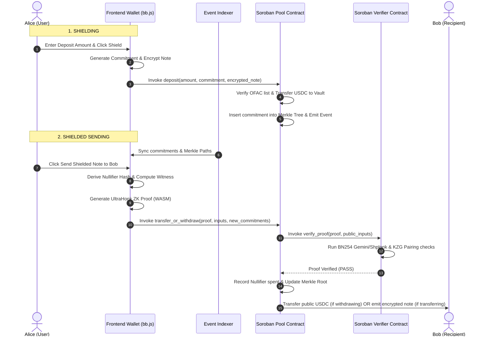

# Stellar Whisper 🌌

[](https://stellar.org)
[](https://soroban.stellar.org)
[](https://noir-lang.org)
[](https://github.com)
[](LICENSE)

Stellar Whisper is a **compliance-first, fully shielded wallet and remittance application** designed for stablecoins (USDC/EURC) on the Stellar network. It integrates advanced off-chain zero-knowledge cryptography (Noir/UltraHonk) with on-chain Soroban verification, enabling private stablecoin transfers while maintaining institutional-grade compliance standards.

---

## 🌟 Key Features

*   **Fully Shielded Transfers**: Deposit public stablecoins (USDC/EURC) into a private Soroban-based pool and execute end-to-end transfers completely off-ledger.
*   **In-Browser Zero-Knowledge Proving**: Witness generation, multi-scalar multiplication (MSM), and polynomial commitment compilation are computed client-side in the browser via Aztec's `@aztec/bb.js` WebAssembly engine, ensuring private keys never leave the user's device.
*   **Double-Spend Nullifier Guard**: Prevents double-spending of shielded notes by recording deterministic, cryptographically blinded nullifiers on-chain.
*   **Cryptographic Value Conservation**: The circuit enforces that the sum of input note values equals the sum of output note values ($\text{input} = \text{withdraw} + \text{recipient} + \text{change}$), so the contract can verify no funds were created or destroyed without learning any amounts.
*   **On-Chain Compliance Screening**: Integrates real-time depositor and recipient screening against sanctioned address lists (OFAC) using admin registries and signed oracle attestations.
*   **Compliant Disclosures (Viewing Keys)**: Users can generate a **ZK Compliance Report** and share Viewing Keys with auditors or tax authorities, allowing selective transaction history decryption and compliance verification without exposing private spending keys.
*   **Offline Event Indexing**: A robust node-based indexer queries, sanitizes, and caches contract events to resolve Soroban testnet event pruning limits.

---

## 🏗️ System Architecture

Stellar Whisper uses client-side WebAssembly proving combined with Soroban's native cryptographic host functions introduced in Protocol 26:



For a comprehensive cryptographic breakdown, see [ARCHITECTURE.md](./ARCHITECTURE.md).

---

## 🔒 How Privacy & Cryptography Works

Stellar Whisper splits privacy, spending capability, and auditing access into separate mathematical concerns.

### 🔑 The Three-Key Model
Instead of relying on a single private key for both balance access and spending, Stellar Whisper derives three distinct keys from the user's existing Stellar wallet — no new credentials required:

```
              ┌───────────────────────────────┐
              │   Stellar Freighter Wallet    │  ← no new credentials required
              └───────────────┬───────────────┘
                              │ SHA-256(Ed25519 signature)
                              ▼
              ┌───────────────────────────────┐
              │     ZK Spending Key (sk)      │ ──► Generates ZK proofs (never leaves browser)
              └───────────────┬───────────────┘
                              │
                 ┌────────────┴────────────┐
                 ▼                         ▼
          ZK Public Key (pk)       Viewing Key (vk)
          Binds ownership to       Encrypts/decrypts note
          Merkle commitments       metadata for discovery
```

1.  **ZK Spending Key (`sk_spend`)**: The root secret key. It is used to generate UltraHonk spend proofs. **This key never leaves the client browser** and is never broadcast to any node or contract.
2.  **ZK Public Key (`pk_zk`)**: Derivation: $\text{Poseidon}(sk_{spend})$. The public identity of the user inside the shielded pool. It binds ownership to note commitments without exposing the user's real Stellar wallet address.
3.  **Viewing Key (`vk_view`)**: A separate cryptographic key used to encrypt and decrypt the note's balance and nonce metadata. Sharing this key gives read-only access to transaction histories.

#### 🔐 Deterministic ZK Spending Key Derivation
To provide a seamless user experience, the ZK Spending Key (`sk_spend`) is derived deterministically from the user's connected **Stellar Freighter Wallet**:
*   The wallet prompts the user to sign a specific, hardcoded authorization message:
    `"Sign this message to authorize Stellar Whisper ZK Privacy Key Derivation"`
*   Because Ed25519 signatures are deterministic, signing this message always yields the same signature bytes for the same Stellar account.
*   The application computes the **SHA-256** hash of the resulting signature bytes to generate the 32-byte ZK Spending Key:
    $$\text{sk\_spend} = \text{SHA-256}(\text{Signature})$$
*   This key is cached in the browser's temporary `sessionStorage` and is wiped when the tab is closed, ensuring it is never stored on any server or disk.

---

### 🔍 Note Discovery (Scan-and-Decrypt vs. Centralized DB)
Unlike traditional mixers that store user metadata on centralized servers (making them vulnerable to hacking and censorship), Stellar Whisper is fully decentralized. It utilizes a **Scan-and-Decrypt** ledger scanner:

*   Whenever a deposit or transfer occurs, the smart contract registers the commitment hash and emits an `encrypted_note` ciphertext event on-chain.
*   The wallet's browser client scans the blocks and tries to decrypt each `encrypted_note` using the user's local **Viewing Key**.
*   If decryption succeeds, the client retrieves the note's `amount` and `nullifier_nonce`, reconstructs the commitment, verifies its position in the Merkle tree, and updates the local balance.
*   If decryption fails, the note is ignored.
*   **Result**: Complete trustless recovery. If you switch devices, you only need your viewing key to scan the ledger and recreate your wallet history from scratch.

---

### 🏛️ Compliance & Auditing Delegation
The segregation of the **Spending Key** (control of funds) from the **Viewing Key** (auditing history) is the core compliance engine of Stellar Whisper. 

*   Users can share their **Viewing Key** with an auditor, tax authority, or compliance officer.
*   The auditor can scan the chain and decrypt that specific user's incoming and outgoing transaction details.
*   However, because the auditor does not have the **ZK Spending Key**, they have **zero spending power** and cannot compromise or steal the user's funds.

---

### 🔄 Concrete Shielded Transfer Walkthrough
Here is how a **10 USDC shielded transfer** from Alice to Bob unfolds across the client, contract, and recipient:

| State / Actor | Action / Payload | Cryptographic Data |
| :--- | :--- | :--- |
| **1. Alice (Sender)** | **Computes locally & Submits** | 1. **ZK Proof (UltraHonk)**: Proves she owns a valid unspent note of $\ge 10$ USDC.<br>2. **Nullifier Hash**: Uniquely derived from her spending key to mark her note spent.<br>3. **Output Commitment 1**: Bob's note $\text{Poseidon}(pk_{zk}^{Bob}, \text{Poseidon}(10, nonce_1))$.<br>4. **Output Commitment 2**: Alice's change note $\text{Poseidon}(pk_{zk}^{Alice}, \text{Poseidon}(change, nonce_2))$.<br>5. **Encrypted Payload 1**: $\text{Encrypt}_{vk_{view}^{Bob}}(10, nonce_1)$.<br>6. **Encrypted Payload 2**: $\text{Encrypt}_{vk_{view}^{Alice}}(change, nonce_2)$. |
| **2. Soroban Contract** | **Validates & Persists** | 1. Calls the **Verifier Contract** to verify the proof against the current Merkle tree root.<br>2. Validates that the submitted Nullifier Hash hasn't been spent before, then saves it to prevent double-spending.<br>3. Inserts the two output commitments as new leaves in the Merkle Tree.<br>4. Emits the encrypted payloads as ledger events. |
| **3. Bob (Recipient)** | **Scans & Receives** | 1. Scans incoming ledger events via the indexer.<br>2. Uses his local `Viewing Key` to decrypt the encrypted payload, exposing $10$ USDC and $nonce_1$.<br>3. Computes the note commitment and confirms it exists in the Merkle Tree.<br>4. Bob's wallet registers a new unspent note of $10$ USDC, ready to be spent. |

---

## 📁 Repository Layout

```
├── contracts/                  # Soroban Smart Contracts
│   ├── whisper/                # Main Shielded Pool Contract (Merkle state & logic)
│   └── verifier/               # Full UltraHonk ZK verifier contract (Gemini + Shplonk + KZG)
├── circuits/                   # Noir ZK Circuits
│   └── whisper/                # Private spend and value conservation circuit
├── frontend/                   # Vite + React (TypeScript) Web Wallet
│   ├── src/components/         # Glassmorphic Wallet UI components
│   ├── src/hooks/              # Wallet connection, notes synchronization & transfer hooks
│   └── src/lib/                # Cryptographic utilities & Merkle path generators
├── indexer/                    # Event indexer caching Soroban ledger events
└── scripts/                    # Build, setup, and deployment orchestrations
```

---

## 🚀 Getting Started

### Prerequisites
*   [Rust & Cargo](https://rustup.rs/) (v1.95.0+)
*   [NodeJS & NPM](https://nodejs.org/) (v24+)
*   [Stellar CLI](https://github.com/stellar/stellar-cli) (v25+)

### 1. Setup Environment
Execute the automated setup script to verify dependencies and install the correct Noir compiler (`nargo`):
```bash
./scripts/setup.sh
```
Ensure the Nargo binary is loaded in your path:
```bash
export PATH="$HOME/.nargo/bin:$PATH"
```

### 2. Run Smart Contract Tests
Validate the cryptographic operations and pool logic in the mock Soroban environment:
```bash
cargo test
```

### 3. Deploy and Initialize (Testnet)
Build, optimize, and deploy the contracts to the Stellar testnet, then export contract IDs to the frontend:
```bash
./scripts/deploy.sh
```
*Note: This script automatically runs `stellar contract optimize` to reduce bytecode size and ensure transactions stay well within testnet gas limits.*

### 4. Run Frontend and Indexer
To circumvent Soroban RPC event pruning limitations, you must run the off-chain indexer concurrently with the frontend:

1.  **Install Workspace Dependencies:**
    From the project root:
    ```bash
    # Install root workspace tooling
    npm install
    
    # Install indexer dependencies
    cd indexer && npm install && cd ..
    
    # Install frontend dependencies
    cd frontend && npm install && cd ..
    ```

2.  **Start Services Concurrently:**
    Run the dev workspace command:
    ```bash
    npm run dev
    ```
    This starts:
    *   **Indexer Service**: `http://localhost:8123` (syncing events to `indexer_db.json`)
    *   **Vite Dev Server**: `http://localhost:5173`

Open [http://localhost:5173](http://localhost:5173) in your browser to access the glassmorphic wallet dashboard.

---

## 🔒 Security & Compliance Disclaimer

Stellar Whisper is a zero-knowledge remittance protocol designed for private stablecoin transfers. 

*   **Zero-Knowledge Proofs**: Real UltraHonk ZK proof bytes are generated client-side and verified on-chain. The on-chain verifier executes the complete cryptographic verification pipeline—including Fiat–Shamir transcript generation, sumcheck protocol verification, and Gemini/Shplonk polynomial opening—using Soroban's native BN254 elliptic curve host functions.
*   **Compliance Framework**: The smart contract verifies note commitments against an admin-controlled or oracle-updated sanction list. Selective disclosure reports can be printed or exported using viewing keys.
*   **Audit Notice**: This repository is a hackathon prototype. The cryptographic pipeline, smart contracts, and proof circuits must be audited by independent professional security engineers and cryptographers before any production deployment.
