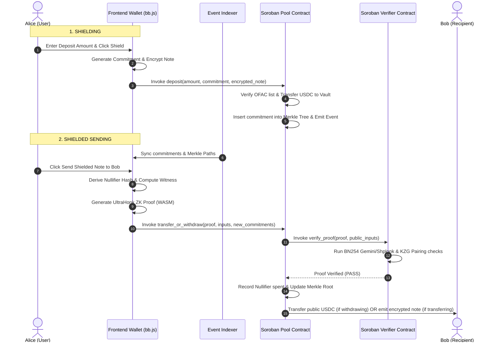

# Stellar Whisper 🌌

[](https://stellar.org)
[](https://soroban.stellar.org)
[](https://noir-lang.org)
[](https://github.com)
[](LICENSE)

Stellar Whisper is a **compliance-first, fully shielded wallet and remittance application** designed for stablecoins (USDC/EURC) on the Stellar network. It integrates advanced off-chain zero-knowledge cryptography (Noir/UltraHonk) with on-chain Soroban verification, enabling private stablecoin transfers while maintaining institutional-grade compliance standards.

---

## 🌟 Key Features

*   **Multi-Asset Shielded Pools**: Simultaneously supports both **USDC** and **XLM** shielded pools within a single contract. Users can deposit, transfer, and withdraw both assets privately, with independent balances, histories, and dashboard metrics.
*   **Hybrid Public-Private Liquidity Pools (Path 1)**: Allows LPs to publicly supply liquidity to the AMM (USDC & wrapped XLM) to earn fee yields, while enabling traders to execute private swaps against the public reserves using ZK spend proofs.
*   **In-Browser Zero-Knowledge Proving**: Witness generation, multi-scalar multiplication (MSM), and polynomial commitment compilation are computed client-side in the browser via Aztec's `@aztec/bb.js` WebAssembly engine, ensuring private keys never leave the user's device.
*   **Double-Spend Nullifier Guard**: Prevents double-spending of shielded notes by recording deterministic, cryptographically blinded nullifiers on-chain.
*   **Cryptographic Value Conservation**: The circuit enforces that the sum of input note values equals the sum of output note values ($\text{input} = \text{withdraw} + \text{recipient} + \text{change}$), so the contract can verify no funds were created or destroyed without learning any amounts.
*   **On-Chain Compliance Screening**: Integrates real-time depositor and recipient screening against sanctioned address lists (OFAC) using admin registries and signed oracle attestations.
*   **Compliant Disclosures (Viewing Keys)**: Users can generate a **ZK Compliance Report** and share Viewing Keys with auditors or tax authorities, allowing selective transaction history decryption and compliance verification without exposing private spending keys.
*   **Offline Event Indexing**: A robust node-based indexer queries, sanitizes, and caches contract events to resolve Soroban testnet event pruning limits.

---

## 🏗️ System Architecture

Stellar Whisper uses client-side WebAssembly proving combined with Soroban's native cryptographic host functions introduced in Protocol 26:



For a comprehensive cryptographic breakdown, see [ARCHITECTURE.md](./ARCHITECTURE.md).

---

## 🔒 How Privacy & Cryptography Works

Stellar Whisper splits privacy, spending capability, and auditing access into separate mathematical concerns.

### 🔑 The Three-Key Model
Instead of relying on a single private key for both balance access and spending, Stellar Whisper derives three distinct keys from the user's existing Stellar wallet — no new credentials required:

```
              ┌───────────────────────────────┐
              │   Stellar Freighter Wallet    │  ← no new credentials required
              └───────────────┬───────────────┘
                              │ SHA-256(Ed25519 signature)
                              ▼
              ┌───────────────────────────────┐
              │     ZK Spending Key (sk)      │ ──► Generates ZK proofs (never leaves browser)
              └───────────────┬───────────────┘
                              │
                 ┌────────────┴────────────┐
                 ▼                         ▼
          ZK Public Key (pk)       Viewing Key (vk)
          Binds ownership to       Encrypts/decrypts note
          Merkle commitments       metadata for discovery
```

1.  **ZK Spending Key (`sk_spend`)**: The root secret key. It is used to generate UltraHonk spend proofs. **This key never leaves the client browser** and is never broadcast to any node or contract.
2.  **ZK Public Key (`pk_zk`)**: Derivation: $\text{Poseidon}(sk_{spend})$. The public identity of the user inside the shielded pool. It binds ownership to note commitments without exposing the user's real Stellar wallet address.
3.  **Viewing Key (`vk_view`)**: A separate cryptographic key used to encrypt and decrypt the note's balance and nonce metadata. Sharing this key gives read-only access to transaction histories.

#### 🔐 Deterministic ZK Spending Key Derivation
To provide a seamless user experience, the ZK Spending Key (`sk_spend`) is derived deterministically from the user's connected **Stellar Freighter Wallet**:
*   The wallet prompts the user to sign a specific, hardcoded authorization message:
    `"Sign this message to authorize Stellar Whisper ZK Privacy Key Derivation"`
*   Because Ed25519 signatures are deterministic, signing this message always yields the same signature bytes for the same Stellar account.
*   The application computes the **SHA-256** hash of the resulting signature bytes to generate the 32-byte ZK Spending Key:
    $$\text{sk\_spend} = \text{SHA-256}(\text{Signature})$$
*   This key is cached in the browser's temporary `sessionStorage` and is wiped when the tab is closed, ensuring it is never stored on any server or disk.

### 🌈 Multi-Asset Segregation & Circuit Binding
To prevent cross-asset correlation and double-spend proof replay attacks (e.g., spending an XLM note to withdraw USDC), Stellar Whisper binds the specific asset's contract address directly into the cryptographic commitments:

*   **Asset Binding in Commitments**: When creating a note, the commitment is computed by incorporating the `asset_id` (the 32-byte representation of the token's Stellar contract address):
    $$\text{commitment} = \text{Poseidon}(pk_{zk}, \text{Poseidon}(amount, nonce, asset\_id))$$
*   **Circuit Enforcement**: The zero-knowledge spend circuit enforces that the `asset_id` of the spent input notes matches the `asset_id` of the newly created output notes (or public withdrawal). This ensures that funds cannot change assets during a private transfer.
*   **Dynamic UI & Analytics**: The dashboard features an independent **Invisible Pool** switcher allowing real-time tracking of:
    *   **Pool TVL**: Total Value Locked computed on-chain for the specific asset.
    *   **24h Volume**: Combined deposits and withdrawals over the last 24 hours.
    *   **Anonymity Set**: Count of unique commitments/notes generated under the asset's contract.

### 🌊 Hybrid Liquidity Pools & Shielded Swaps (Path 1)
Stellar Whisper implements a unique **Hybrid AMM** model that links standard public liquidity pools directly to private shielded transactions:

*   **Public Liquidity Provision (LP)**: Anyone can publicly deposit liquidity into the constant-product AMM pool by calling the contract's `add_liquidity` and `remove_liquidity` functions. LPs receive standard LP shares representing their stake in the pool and earn a `0.3%` fee on all swaps, with zero ZK complexity for LPs.
*   **Shielded Swaps**: Traders can swap assets privately against the public pool reserves. Using a ZK proof, a trader spends a private note of Asset A (e.g. USDC). The contract verifies the proof, executes a constant-product swap against the public reserves, and mints a new private note of Asset B (e.g. XLM) for the trader's ZK public key.
*   **Decoupled Privacy**: The total pool reserves, TVL, and LP deposits are fully public, ensuring deep liquidity. However, the trader's identity, input note value, and output note value remain completely shielded under zero-knowledge encryption, solving the liquidity constraints of pure private pools.

---

### 🔍 Note Discovery (Scan-and-Decrypt vs. Centralized DB)
Unlike traditional mixers that store user metadata on centralized servers (making them vulnerable to hacking and censorship), Stellar Whisper is fully decentralized. It utilizes a **Scan-and-Decrypt** ledger scanner:

*   Whenever a deposit or transfer occurs, the smart contract registers the commitment hash and emits an `encrypted_note` ciphertext event on-chain.
*   The wallet's browser client scans the blocks and tries to decrypt each `encrypted_note` using the user's local **Viewing Key**.
*   If decryption succeeds, the client retrieves the note's `amount` and `nullifier_nonce`, reconstructs the commitment, verifies its position in the Merkle tree, and updates the local balance.
*   If decryption fails, the note is ignored.
*   **Result**: Complete trustless recovery. If you switch devices, you only need your viewing key to scan the ledger and recreate your wallet history from scratch.

---

### 🏛️ Compliance & Auditing Delegation
The segregation of the **Spending Key** (control of funds) from the **Viewing Key** (auditing history) is the core compliance engine of Stellar Whisper. 

*   Users can share their **Viewing Key** with an auditor, tax authority, or compliance officer.
*   The auditor can scan the chain and decrypt that specific user's incoming and outgoing transaction details.
*   However, because the auditor does not have the **ZK Spending Key**, they have **zero spending power** and cannot compromise or steal the user's funds.

---

### 🔄 Concrete Shielded Transfer Walkthrough
Here is how a **10 USDC shielded transfer** from Alice to Bob unfolds across the client, contract, and recipient:

| State / Actor | Action / Payload | Cryptographic Data |
| :--- | :--- | :--- |
| **1. Alice (Sender)** | **Computes locally & Submits** | 1. **ZK Proof (UltraHonk)**: Proves she owns a valid unspent note of $\ge 10$ USDC.<br>2. **Nullifier Hash**: Uniquely derived from her spending key to mark her note spent.<br>3. **Output Commitment 1**: Bob's note $\text{Poseidon}(pk_{zk}^{Bob}, \text{Poseidon}(10, nonce_1))$.<br>4. **Output Commitment 2**: Alice's change note $\text{Poseidon}(pk_{zk}^{Alice}, \text{Poseidon}(change, nonce_2))$.<br>5. **Encrypted Payload 1**: $\text{Encrypt}_{vk_{view}^{Bob}}(10, nonce_1)$.<br>6. **Encrypted Payload 2**: $\text{Encrypt}_{vk_{view}^{Alice}}(change, nonce_2)$. |
| **2. Soroban Contract** | **Validates & Persists** | 1. Calls the **Verifier Contract** to verify the proof against the current Merkle tree root.<br>2. Validates that the submitted Nullifier Hash hasn't been spent before, then saves it to prevent double-spending.<br>3. Inserts the two output commitments as new leaves in the Merkle Tree.<br>4. Emits the encrypted payloads as ledger events. |
| **3. Bob (Recipient)** | **Scans & Receives** | 1. Scans incoming ledger events via the indexer.<br>2. Uses his local `Viewing Key` to decrypt the encrypted payload, exposing $10$ USDC and $nonce_1$.<br>3. Computes the note commitment and confirms it exists in the Merkle Tree.<br>4. Bob's wallet registers a new unspent note of $10$ USDC, ready to be spent. |

---

## 📚 Documentation

| Document | Description |
|----------|-------------|
| [ARCHITECTURE.md](./ARCHITECTURE.md) | Deep cryptographic & system architecture |
| [docs/OVERVIEW.md](./docs/OVERVIEW.md) | Project overview and key concepts |
| [docs/SETUP.md](./docs/SETUP.md) | Detailed setup guide with troubleshooting |
| [docs/SMART_CONTRACTS.md](./docs/SMART_CONTRACTS.md) | Smart contract API reference (Whisper + Verifier) |
| [docs/FRONTEND.md](./docs/FRONTEND.md) | Frontend architecture, hooks, and cryptography |
| [docs/INDEXER.md](./docs/INDEXER.md) | Indexer REST API and relay proxy docs |
| [docs/CIRCUITS.md](./docs/CIRCUITS.md) | ZK circuit specification and constraints |
| [docs/TESTING.md](./docs/TESTING.md) | Testing guide with test descriptions |
| [docs/DEPLOYMENT.md](./docs/DEPLOYMENT.md) | Deployment guide (automated + manual) |
| [docs/FAQ.md](./docs/FAQ.md) | Frequently asked questions |
| [liquidity_pools_walkthrough.md](./liquidity_pools_walkthrough.md) | Hybrid AMM walkthrough |
| [DESIGN.md](./DESIGN.md) | Glassmorphic design system specification |

---

## 📁 Repository Layout

```
├── ARCHITECTURE.md              # Cryptographic & system architecture deep dive
├── DESIGN.md                    # Glassmorphic design system specification
├── liquidity_pools_walkthrough.md   # Hybrid AMM walkthrough
├── docs/                        # Comprehensive documentation suite
│   ├── OVERVIEW.md, SETUP.md, SMART_CONTRACTS.md, FRONTEND.md
│   ├── INDEXER.md, CIRCUITS.md, TESTING.md, DEPLOYMENT.md, FAQ.md
├── contracts/                   # Soroban Smart Contracts (Rust)
│   ├── whisper/                 # Shielded Pool Contract (Merkle, AMM, compliance)
│   └── verifier/                # UltraHonk ZK verifier contract
├── circuits/                    # Noir ZK Circuits
│   └── whisper/                 # Spend circuit (139 lines, 8 public inputs)
├── frontend/                    # Vite + React (TypeScript) Web Wallet
│   ├── src/components/          # Glassmorphic UI components
│   ├── src/hooks/               # Wallet connection, notes, transfers
│   └── src/lib/                 # Crypto primitives, Merkle utilities
├── indexer/                     # Node.js event indexer + relay proxy
└── scripts/                     # Build, setup, and deployment scripts
```

---

## 🚀 Getting Started

See the [detailed setup guide](./docs/SETUP.md) for full instructions. Quick start:

```bash
# Prerequisites: Rust, Node.js >= 24, Stellar CLI >= 25

# 1. Setup dependencies
./scripts/setup.sh && export PATH="$HOME/.nargo/bin:$PATH"

# 2. Install all package dependencies
npm install && cd indexer && npm install && cd ../frontend && npm install && cd ..

# 3. Run tests
cargo test

# 4. Deploy to testnet
./scripts/deploy.sh

# 5. Start frontend + indexer
npm run dev
# Frontend: http://localhost:5173 | Indexer: http://localhost:8123
```

See [docs/SETUP.md](./docs/SETUP.md) for troubleshooting, [docs/DEPLOYMENT.md](./docs/DEPLOYMENT.md) for deployment options, and [docs/INDEXER.md](./docs/INDEXER.md) for the indexer API.

---

## ⚡ Gasless Transaction Relayer (OpenZeppelin Channels)

Stellar Whisper integrates **OpenZeppelin's managed Stellar Channels service** to enable fully gasless and anonymous shielded transfers and withdrawals.

### 🛡️ How it Works
1. **Off-Chain Proof Generation:** When you execute a shielded transfer or withdrawal, the frontend generates an Aztec UltraHonk proof client-side and serializes the contract invocation's **HostFunction XDR**.
2. **Signature-Free Invocation:** Because note ownership and value conservation are authorized entirely by the Zero-Knowledge proof, **no user wallet signature is required** to execute the transaction.
3. **Secure Proxy Relay:** The frontend dispatches the unsigned host function XDR to the local **Indexer proxy endpoint** (`/api/relay`). The indexer securely appends your OpenZeppelin API Key and forwards the payload to the OpenZeppelin Channels Service. This prevents your private API key from ever being exposed to the browser.
4. **Sponsor Fee-Bump Envelopes:** The OpenZeppelin service wraps the contract call inside a sponsored **fee-bump transaction envelope** and broadcasts it to the Stellar Soroban Testnet.
5. **Absolute Unlinkability:** The transaction is completed without the user needing to pay network gas fees or hold any XLM. This removes the possibility of a "gas funding source" correlation attack, ensuring absolute cryptographic unlinkability and a seamless, premium UX.

### 🔑 Setup Instructions
See the [relayer configuration docs](./docs/INDEXER.md#relay-flow) for detailed setup. Quick start:
1. **Generate a free API Key:** Visit [https://channels.openzeppelin.com/testnet/gen](https://channels.openzeppelin.com/testnet/gen)
2. **Add to Environment:** `OPENZEPPELIN_CHANNELS_API_KEY="your_key"` in `frontend/.env`
3. **Restart services:** `npm run dev` — transactions route through the relayer automatically.

---

## 🔒 Security & Compliance Disclaimer

Stellar Whisper is a zero-knowledge remittance protocol designed for private stablecoin transfers. 

*   **Zero-Knowledge Proofs**: Real UltraHonk ZK proof bytes are generated client-side and verified on-chain. The on-chain verifier executes the complete cryptographic verification pipeline—including Fiat–Shamir transcript generation, sumcheck protocol verification, and Gemini/Shplonk polynomial opening—using Soroban's native BN254 elliptic curve host functions.
*   **Compliance Framework**: The smart contract verifies note commitments against an admin-controlled or oracle-updated sanction list. Selective disclosure reports can be printed or exported using viewing keys.
*   **Audit Notice**: This repository is a hackathon prototype. The cryptographic pipeline, smart contracts, and proof circuits must be audited by independent professional security engineers and cryptographers before any production deployment.
