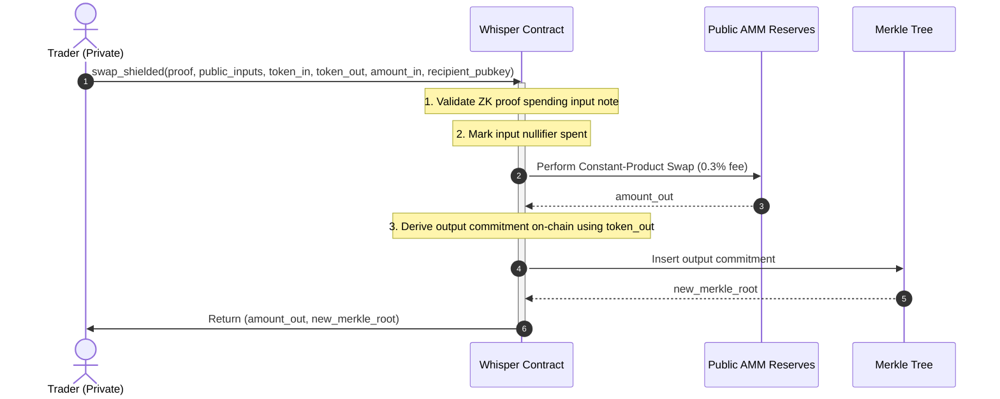

# Hybrid Shielded Swap Walkthrough (Path 1)

This walkthrough documents the design and integration of the hybrid zero-knowledge swap functionality linking standard public AMM reserves to Stellar Whisper's shielded notes.

## 1. Protocol Architecture & Mechanics

The implementation uses **Path 1** (Public Liquidity Pools with Shielded Swaps), where pool reserves are public but traders can execute private swaps against them:



### Constant-Product Swap Calculation
Inside the contract, the output amount is calculated with a `0.3%` fee using the constant-product formula:

$$\text{amount\_out} = \frac{\text{reserve\_out} \cdot (\text{amount\_in} \cdot 997)}{\text{reserve\_in} \cdot 1000 + \text{amount\_in} \cdot 997}$$

---

## 2. On-Chain Modulo Reduction for Poseidon Hash

Because SHA-256 hashes of asset IDs or large public inputs can be greater than or equal to the BN254 scalar field modulus ($r$), passing raw bytes directly to Poseidon hashing can lead to an `input exceeds field modulus` host error.

To align with client-side hashing (`modScalarField` in `crypto.ts`), we implemented a manual big-integer division/reduction helper in raw Rust:

```rust
fn sub_big(a: &mut [u8; 32], b: &[u8; 32]) -> bool {
    let mut borrow = 0i32;
    let mut temp = [0u8; 32];
    for i in (0..32).rev() {
        let diff = (a[i] as i32) - (b[i] as i32) - borrow;
        if diff < 0 {
            temp[i] = (diff + 256) as u8;
            borrow = 1;
        } else {
            temp[i] = diff as u8;
            borrow = 0;
        }
    }
    if borrow == 0 {
        *a = temp;
        true
    } else {
        false
    }
}

fn reduce_bn254_modulus(mut value: [u8; 32]) -> [u8; 32] {
    let modulus = [
        0x30, 0x64, 0x4e, 0x72, 0xe1, 0x31, 0xa0, 0x29,
        0xb8, 0x50, 0x45, 0xb6, 0x81, 0x81, 0x58, 0x5d,
        0x28, 0x33, 0xe8, 0x48, 0x79, 0xb9, 0x70, 0x91,
        0x43, 0xe1, 0xf5, 0x93, 0xf0, 0x00, 0x00, 0x01
    ];
    while sub_big(&mut value, &modulus) {}
    value
}
```

This reduces any input to be strictly less than $r$ in at most 6 subtraction iterations without any external dependencies, ensuring compatibility with the WASM runtime.

---

## 3. Frontend Integration & Soroban Interactivity

The frontend `<LiquidityPanel />` is now connected to live Soroban contract endpoints via the custom wallet execution pipeline:
- **Reserves & Totals**: Retrieves current pool reserves (`get_reserves`) and total issued LP shares (`get_total_lp_shares`) via RPC simulation.
- **LP Provision**: Invokes `add_liquidity(user, amount_a, amount_b)` on-chain, automatically prompting Freighter signature requests for multi-authorization footprint transfers.
- **LP Withdrawal**: Redeems shares via `remove_liquidity(user, shares)`, burning the specified percentage and returning underlying token balances to the user.
- **Visual Accuracy**: Automatically calculates user pool share, underlying asset values, and estimated withdrawal payouts based on real pool metrics.

---

## 4. Test Suite Verification

All components compile and compile-time type safety is fully verified. Running a production Vite build completes with zero errors.

We added tests in `contracts/whisper/src/test.rs` to validate the pool lifecycle:
1. `test_public_liquidity_provision`: Verifies public LP deposits, share calculations, and token redemptions.
2. `test_whisper_shielded_swap`: Validates public-private hybrid swaps against AMM reserves using ZK spend proofs.

All 18 unit tests in the Rust contract compile and pass cleanly:
```bash
running 18 tests
test test::test_oracle_sanctions_updates ... ok
test test::test_public_liquidity_provision ... ok
test test::test_cross_layer_fixtures ... ok
test test::test_whisper_failed_token_transfer_rollback ... ok
test test::test_whisper_invalid_merkle_root - should panic ... ok
test test::test_whisper_double_spend - should panic ... ok
test test::test_whisper_flow ... ok
test test::test_whisper_duplicate_deposit_commitment - should panic ... ok
test test::test_whisper_sanctioned_address_deposit_rejected - should panic ... ok
test test::test_whisper_invalid_proof - should panic ... ok
test test::test_whisper_public_withdraw_with_non_zero_output_commitments - should panic ... ok
test test::test_whisper_public_withdraw_with_change ... ok
test test::test_whisper_sanctioned_address_withdraw_rejected - should panic ... ok
test test::test_whisper_shielded_transfer_with_non_zero_public_withdraw_amount - should panic ... ok
test test::test_whisper_tree_full - should panic ... ok
test test::test_whisper_shielded_transfer_mismatched_new_commitments - should panic ... ok
test test::test_whisper_shielded_swap ... ok
test test::test_whisper_shielded_transfer ... ok

test result: ok. 18 passed; 0 failed; 0 ignored; 0 measured; 0 filtered out; finished in 4.32s
```
